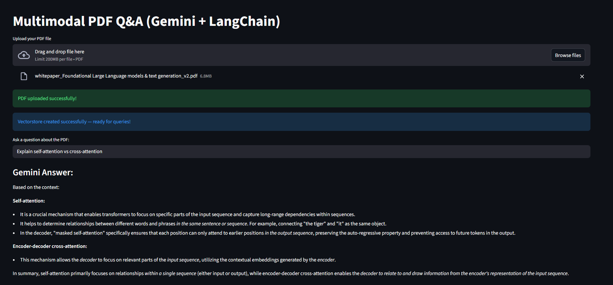

#  Multimodal RAG Application

An interactive **Streamlit dashboard** that allows users to upload PDFs (text + images), and get AI-powered answers using **Google Gemini**, **LangChain**, and **HuggingFace embeddings**.

##  Overview

This app demonstrates a **Multimodal RAG (Retrieval-Augmented Generation)** system — it can understand and answer questions based on:
- **Text** content inside PDFs
- **Images** embedded in the PDF
- **Tables**
- Combined multimodal reasoning (text + visual)

Simply upload a PDF file, ask any question, and the model will answer based only on your document content.

##  Tech Stack

- Frontend: Streamlit 

- AI Model: Google Gemini 2.5 Flash

- Framework: LangChain

- Vector Store: ChromaDB

- Embeddings: HuggingFace (Sentence Transformers)

- File Handling: PyMuPDF + base64

- Language: Python 3.10+

